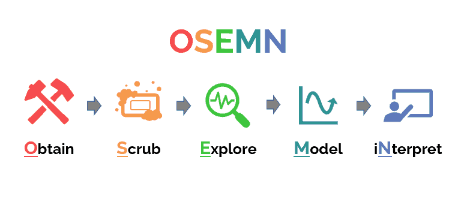

# Overview of EDA

---

- [Overview of EDA](#overview-of-eda)
  - [Introduction to Exploratory Data Analysis](#introduction-to-exploratory-data-analysis)
  - [Why Does EDA Matter?](#why-does-eda-matter)
  - [Applications of EDA in the real world](#applications-of-eda-in-the-real-world)
  - [Role of EDA in the Data Science workflow](#role-of-eda-in-the-data-science-workflow)
  - [Steps in EDA](#steps-in-eda)
  - [Common tools and libraries for EDA](#common-tools-and-libraries-for-eda)

> Kaguya Houraisan

---

## Introduction to Exploratory Data Analysis

Imagine stepping into a dark, unfamiliar room filled with furniture. You wouldn’t sprint across it
blindly, instead, you’d feel around for the switch, turn on a light, and get a sense of the layout before
making any moves. **Exploratory Data Analysis (EDA) is that light switch in the world of data science.**

Before we build predictive models, run algorithms, or make bold claims, we must first **understand our data’s shape, quirks, and hidden stories.** EDA is the process of poking, prodding, and exploring data
to see what’s inside, ensuring we know the terrain we’re about to navigate.

The concept was popularized by statistician **John Tukey**, who believed that data should first be explored freely, not just analyzed through rigid formulas. “Data analysis,” he argued, “should be like
detective work—curious, open-minded, and iterative.”

## Why Does EDA Matter?

Data is never perfect. It is often messy, incomplete, or misleading—like a jigsaw puzzle with missing or
extra pieces. EDA helps you:

- Spot problems early: Missing values, incorrect entries, outliers.
- Find relationships: Which variables seem to influence others?
- Avoid wasted effort: Prevents building models on faulty assumptions.

In short, **EDA is not just a step—it’s a safety net**. Skipping it is like publishing a book without proofreading.

## Applications of EDA in the real world

1. **Finance:** Analysts scan transaction data to uncover fraudulent activity. EDA reveals suspicious
spikes that could indicate scams long before they escalate.
2. **Healthcare**: Researchers explore patient records to identify risk factors. Patterns in age, lifestyle,
or genetics can emerge before any formal modeling.
3. **Marketing:** Social media teams analyze engagement metrics. By exploring which posts perform
well and why, they refine campaigns with data-backed confidence.
4. **Science:** EDA is the sanity check in experiments. Imagine testing a new drug only to discover

later that half your control group had pre-existing conditions. EDA saves you from such costly mistakes.

## Role of EDA in the Data Science workflow

Different data scientists have different processes for conducting their projects. And different types
of projects require different steps. However, most data science projects flow through a similar workflow.
One popular representation of this workflow is called OSEMN (pronounced “awesome”).

**Hilary Mason and Chris Wiggins** created OSEMN in their **2010** post called **“A Taxonomy of Data Science”**. OSEMN is a somewhat clever acronym with each letter representing a phase of a data science
project: **Obtain, Scrub, Explore, Model, and iNterpret**

In OSEMN’s third phase, you are not yet testing any hypotheses or making predictions. Rather, you are exploring the data using various techniques to better understand the data and its story.

Additionally, you might want to provide descriptive statistics on the data and create dashboards to facilitate ad hoc data exploration for you and your stakeholders. Regardless, typically your objective in this phase should not be to understand every minor detail but rather to get a good sense of the data before proceeding to the following phases.

## Steps in EDA

1. Understand the data structure
   - Before touching a single statistic, learn the shape of the room you’re in. This step prevents category leakage and wrong aggregation or mistakes that clever modeling can’t fix. some steps we can take in part of the process are:
     - a. **Unit of analysis:** What does one row represent is it a user, a session, a transaction, or a day? Misidentifying this breaks every conclusion downstream.
     - b **Schema & types:** List columns, their data types (numeric, categorical, text, datetime, geographical location), allowed ranges, and **measurement scales** (nominal/ordinal/interval/ratio).
     - c **Keys & granularity**: Identify unique keys (primary keys) and join keys (foreign keys). Check for duplicates and inconsistent grain (e.g., mixing user-level and session-level fields).
     - d. **Time structure:** Frequency (hourly/daily/weekly), time zone, seasonality, gaps, and whether the series is **regular** or **event-driven**
     - e. **Domain constraints:** Business rules (e.g., age ≥ 0; price ≥ cost) and “impossible”
combinations.

2. Identifying Missing data

   - Missingness is a **signal**, not just a nuisance. Being able to recognize and fix them early on can
greatly affect the outcome of any analysis. Name the kind of missingness, quantify it, and choose a treatment strategy you can defend.
     - a. **Map the gaps**: Count missing by column and by row; visualize patterns (is the missingness clustered by date, cohort, geography or other parameter).
     - b. **Identify the Type of missingness**: i. MCAR: Missing completely at random (rare). ii. MAR: Missing depends on observed data (common). iii. MNAR: Missing depends on the unobserved value (dangerous).
     - c. **Plan of attack**: know the best method for handing the missing data Deletion (safe when low proportion & MCAR), simple imputation (median/mode), model-based imputation (KNN, MICE), or domain-driven rules.

3. Describe the data

   - This is your **first sketch** of the landscape. In this step we commonly use descriptive
statistics. Move beyond “mean and median” to how values are distributed. The shape tells you
what the average cannot.

4. Identifying the Outliers

   - Outliers are *stories at the edges—errors**, rare events, or crucial signals. Don’t reflexively delete outliers; **Diagnose, document, and decide** because each outlier is a and can be a hypothesis trigger. Outliers can dominate means, correlations, and regressions—consider robust alternatives (median, Spearman, Huber loss).

5. Explore relationships between variables

   - Pair the right visualization with the right summary and respect assumptions. Relationships change under aggregation therefore slice thoughƞully.

6. Forming hypothesis

   - EDA is the question generator for the confirmatory phase. Hypotheses convert curiosity into a roadmap; Each hypothesis should imply a next step, whether it to experiment, causal design, feature engineering, or additional data collection. They anchor what you explore next and how you’ll verify it.

## Common tools and libraries for EDA

1. Python:
   - Pandas
   - NumPy
   - Matplotlib
   - Seaborn
   - Plotly.
2. R:
   - tidyverse (ggplot2, dplyr, tidyr).
3. BI Tools:
   - Tableau, Power BI.
4. Notebooks:
   - Jupyter, RStudio. 
